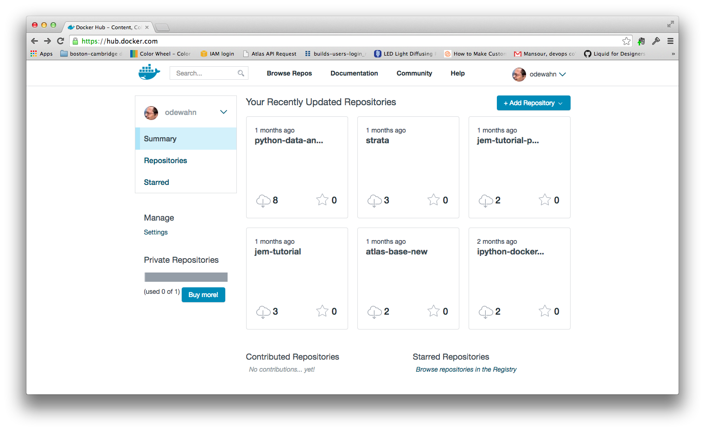

# Sharing images on Docker Hub

The [Docker Hub](https://hub.docker.com) is a site where you store and share images you create.  Consciously modeled on [GitHub](https://github.com/), the site offers features like:

* Docker image hosting.  Like GitHub, public images are free and private images are paid
* Collaborators who can push and pull the images
* Webhooks that are fired when a new image is pushed
* Statistics tracking, such as downloads and stars

There are two key ways to interact with the Docker Hub:

* The Web interface, where you can register, manage image metadata (description, etc), add or remove collaborators, and so forth.  This is similar to GitHub.
* The docker command line tool, where you can pull, push, or search for images.  This is similar to git.

There are a number of features specific to Docker.  One of the most interesting, [trusted builds](http://blog.docker.com/2013/11/introducing-trusted-builds/), allow you to create signed images based on a Dockerfile in GitHub or BitBucket.  As with a CI/CD tool, the trusted build is triggered by a post commit hook on your repo so that your image will also be up to date with your codebase. In addition, the image is flagged with a "trusted build" badge so that you can verity its source.

## Create an account

The first step to using Docker Hub is to sign up, which you can do on their [Signup page](https://hub.docker.com/account/signup/).  You'll be asked for an email address, username, and a password.  Once you log in, you'll see a project dashboard that's similar to other hosting sites:



Once you've set up your account, you use the `docker login` command from your terminal so that you can pull and push images from your account.  (Note that you can also register with this command, as well, if you want to not use the site.)  Once you log in, Docker will store your credentials in a file called `.dockercfg` in your home directory.

## Searching for images

One of the most basic things you can do with the Hub is search for other images using `docker search`.  Here, for example, are the first few results returned by the `docker search ubuntu` command.  As of this writing, we get over 1300 matches, so be prepared to wait a bit for the results.)

```console
$ docker search ubuntu
NAME                                             DESCRIPTION                                     STARS     OFFICIAL   AUTOMATED
ubuntu                                           Official Ubuntu base image                      525       [OK]       
stackbrew/ubuntu                                 Official Ubuntu base image                      40        [OK]       
dockerfile/ubuntu                                Trusted Ubuntu (http://www.ubuntu.com/) Bu...   19                   [OK]
crashsystems/gitlab-docker                       A trusted, regularly updated build of GitL...   19                   [OK]
ubuntu-upstart                                   Upstart is an event-based replacement for ...   10        [OK]       
dockerfile/ubuntu-desktop                        Trusted Ubuntu Desktop (LXDE) (http://lxde...   9                    [OK]
lukasz/docker-scala                              Dockerfile for installing Scala 2.10.3, Ja...   7                    [OK]
litaio/ruby                                      Ubuntu 14.04 with Ruby 2.1.2 compiled from...   7                    [OK]
mbentley/ubuntu-django-uwsgi-nginx                                                               6                    [OK]
cmfatih/phantomjs                                PhantomJS [ phantomjs 1.9.7, casperjs 1.1....   5                    [OK]
zmarcantel/cassandra                             Cluster/Standalone DataStax Cassandra on U...   4                    [OK]
suttang/gollum                                   The gollum wiki installed on ubuntu             4                    [OK]
...
```

The command returns the following columns:

* Name.  This is the name and namespace of the image.  (More on namespaces in a bit.)
* Description.  This is metadata about the image from Docker Hub.
* Stars.  The number of people who have "starred" the image
* Official.  Whether or not the image comes from Docker, Inc.  An "OK" in this column helps provide some sense of security that the image has been vetted.
* Automated.  Whether or not the image is the result of an automated build.  While less authoritative than an "Offical" image, an automated image will provide a link to the source GitHub or BitBucket repo on which the image is based.  This way you can at least review the contents of the image before you start it on your environment.

As you undoubtedly noticed, there are a couple of formats in the "Name" column.  Some images have just a single name, like "ubuntu," and some have two names separated by a slash, like "crashsystems/gitlab-docker."  This naming convention is a reflection of Docker's namespace.  There are two namespace main levels: 

* Root.  This is the namespace is reserved for "root" images maintained directly by Docker, Inc.  Basically, it's an "empty" space, and the names are things like "ubuntu" or "debian."
* User.  This namespace is for users within the Docker Hub, such as "crashsystems/gitlab-docker," "mbentley/ubuntu-django-uwsgi-nginx," or "suttang/gollum"


## Pulling an image

Pulling any of these images is simple: just use `docker pull` and whatever the name is.  For example, here's how you pull all layers of the "stackbrew/ubuntu" image:

```
$ $ docker pull stackbrew/ubuntu
Pulling repository stackbrew/ubuntu
822a01ae9a15: Pulling dependent layers 
c4ff7513909d: Download complete 
195eb90b5349: Pulling dependent layers 
bac448df371d: Download complete 
dfaad36d8984: Download complete 
5796a7edb16b: Download complete 
af82eb377801: Downloading [===========>                                       ] 16.38 MB/68.7 MB 164h59m35s
3af9d794ad07: Downloading [========================>                          ] 19.07 MB/39.53 MB 55h25m0s
93c381d2c255: Downloading [================>                                  ] 12.58 MB/39.17 MB 109h9m35s
1c9383292a8f: Download complete 
...
```

As discussed in the chapter on images, you can also pull only the layers of the latest build by adding ":latest" to the name.  (Otherwise you'll pull the full history.)

## Pushing an Image

Let's try to push an image to the Hub.  Unlike the previous `search` and `pull` commands, you must be logged in to push.  If you're not already logged in, Docker will prompt you for your credentials

```
$ docker push simple_flask:latest
2014/09/03 12:42:10 You cannot push a "root" repository. Please rename your repository in <user>/<repo> (ex: odewahn/simple_flask:latest)
```

This rather self-explanatory error occurs because we didn't specify a username when we created the image.  To push to the Docker Hub, though, you must specify a username.  (Unless you're lucky enough to be making Docker's official images, in which case you probably don't need this book!)  So, let's add our username using the `docker tag` command:

```
$ docker tag simple_flask odewahn/simple_flask
```

Once you've retagged the image, you can push it to the Hub:

```console
$ docker push odewahn/simple_flask:latest
The push refers to a repository [odewahn/simple_flask] (len: 1)
Sending image list

Please login prior to push:
Username: odewahn
Password: 
Email: odewahn@oreilly.com
Login Succeeded
The push refers to a repository [odewahn/simple_flask] (len: 1)
Sending image list
Pushing repository odewahn/simple_flask (1 tags)
511136ea3c5a: Image already pushed, skipping 
1c9383292a8f: Image already pushed, skipping 
9942dd43ff21: Image already pushed, skipping 
d92c3c92fa73: Image already pushed, skipping 
0ea0d582fd90: Image already pushed, skipping 
cc58e55aa5a5: Image already pushed, skipping 
c4ff7513909d: Image already pushed, skipping 
c21c062b086a: Image successfully pushed 
Pushing tag for rev [c21c062b086a] on {https://cdn-registry-1.docker.io/v1/repositories/odewahn/simple_flask/tags/latest}
```